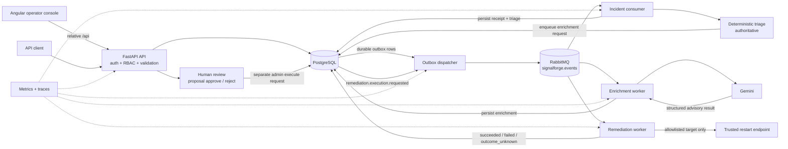

# SignalForge architecture

SignalForge is an incident intake, triage, and controlled remediation platform. It is intentionally **not** a general-purpose DevOps platform. The system focuses on durable incident workflows, deterministic operational decisions, advisory AI enrichment, and human-controlled remediation.

## System boundary

SignalForge owns the lifecycle from authenticated incident intake through triage, advisory enrichment, remediation review, execution request, and durable execution outcome. It integrates with PostgreSQL for state, RabbitMQ for asynchronous delivery, Gemini for optional advisory enrichment, and operator-configured HTTP endpoints for the single supported remediation action, `restart_service`.

The current design is a modular monolith for domain logic plus standalone worker processes. That keeps local development and deployment understandable while still separating the API request path from asynchronous work that has different reliability and latency characteristics.

## Synchronous and asynchronous paths

The synchronous path handles authentication, authorization, validation, reads, and state transitions that must return an immediate authoritative result. Incident lifecycle changes are server-authoritative and follow `open -> acknowledged -> resolved`; clients cannot arbitrarily edit status or reopen an incident.

Longer-running or externally coupled work leaves the request path. Incident creation commits both the incident and an immutable `incident.created` outbox intent in PostgreSQL, while publication happens later. Triage processing, AI enrichment, and remediation execution are handled by standalone workers rather than by the FastAPI request thread.

## Transactional outbox

SignalForge uses a PostgreSQL transactional outbox to avoid the classic database/message-broker dual-write problem. Incident creation and its corresponding outbox intent commit in the same database transaction. The dispatcher later claims due rows, publishes persistent messages through RabbitMQ publisher confirms, and conditionally settles the outbox row.

This design deliberately makes an **at-least-once** delivery claim, not an exactly-once claim. A crash or ambiguous publication result can lead to redelivery. Consumers therefore use durable receipts and idempotent persistence rather than assuming a message can only arrive once.

## Deterministic triage and advisory AI

Deterministic triage is the authoritative operational baseline. The persisted incident event snapshot maps severity directly to priority:

- `critical` -> P1 and requires human review
- `high` -> P2
- `medium` -> P3
- `low` -> P4

The incident consumer atomically persists both its durable processing receipt and the deterministic triage result. Duplicate delivery does not recalculate or mutate an already committed triage record.

AI enrichment is intentionally separate. The enrichment worker receives a durable request after triage, calls Gemini with schema-constrained output, and persists advisory context. The model cannot change incident status, priority, review requirements, or trigger remediation. Provider failure also cannot make incident creation or deterministic triage unavailable.

## Remediation safety model

Remediation is a human-in-the-loop workflow rather than an automatic response system.

A proposal identifies an incident, the supported action `restart_service`, a logical target, and a reason. Operators and admins may create proposals. A proposer cannot approve their own proposal. Approval records the human decision but performs no external action.

Execution requires a separate admin request. That request atomically creates one durable execution record and one `remediation.execution.requested` outbox event. The worker resolves the logical target through an operator-controlled allowlist of fixed HTTP(S) endpoints; proposal text is never interpreted as a URL or shell command. The allowlist defaults to empty and the worker fails closed.

The worker performs at most one actuator attempt for a durable execution. It does not blindly retry an external side effect after timeouts, transport failures, cancellation, or server-side uncertainty.

## Why `outcome_unknown` exists

External effects can become ambiguous. A restart endpoint may have received and performed a request even if the client times out before receiving the response. Treating that case as a normal failure and retrying could repeat a side effect.

SignalForge therefore distinguishes `outcome_unknown` from both `failed` and `succeeded`. A stale or interrupted in-progress execution can become `outcome_unknown` after its lease expires. The frontend preserves the same boundary: if an execution request response is ambiguous, it reads the durable execution state before offering another deliberate request.

This is a safety choice, not merely an error-handling detail.

## Worker model

The dispatcher, incident consumer, enrichment worker, and remediation worker are separate runtimes built from the same backend application image. They reconnect with bounded backoff and expose process-local metrics. RabbitMQ consumers use low prefetch and commit durable state before ACK where the workflow requires idempotent redelivery handling.

The API does not depend on worker availability for readiness. PostgreSQL remains the API readiness dependency, while broker and worker outages leave durable work pending for later processing.

## Observability

SignalForge emits structured JSON logs, bounded-label Prometheus metrics, and optional OpenTelemetry traces.

The local observability profile provides:

- OpenTelemetry Collector for OTLP/HTTP ingestion
- Tempo for traces
- Prometheus for metrics
- Grafana with a provisioned SignalForge dashboard

Tracing spans the API, outbox publication, consumer processing, Gemini calls, remediation processing, and actual actuator HTTP calls. IDs, user-controlled target names, secrets, prompts, raw model responses, and endpoint URLs are intentionally excluded from metric labels and sensitive telemetry fields.

Observability is diagnostic infrastructure. It is not part of liveness, readiness, or business correctness.

## Local packaging topology

The default Compose stack contains PostgreSQL, FastAPI, RabbitMQ, the dispatcher, and the incident consumer. Optional profiles add capabilities without changing the deterministic core:

- `demo`: production Angular build served by Nginx on loopback, with same-origin `/api` proxying
- `ai`: Gemini enrichment worker
- `remediation`: controlled remediation worker
- `observability`: Collector, Tempo, Prometheus, and Grafana

The packaged frontend uses relative `/api/...` requests. Nginx serves the Angular SPA, preserves API paths when proxying to `backend:8000`, and keeps SPA fallback separate from `/api` routing.

Database migrations and user bootstrap remain explicit one-shot operations. No service silently runs migrations or creates a default administrator at startup.

## Intentional non-goals

The current project deliberately does not claim or implement:

- exactly-once delivery or exactly-once external execution
- automatic AI-driven priority changes or remediation
- arbitrary shell/command execution
- a general-purpose workflow or DevOps orchestration platform
- RAG or vector search
- Kubernetes, Helm, Terraform, or cloud deployment infrastructure
- a full event-sourced domain model
- production alerting or centralized log storage

Those omissions keep the project centered on a smaller set of reliability, safety, and operability problems that are implemented end to end.
